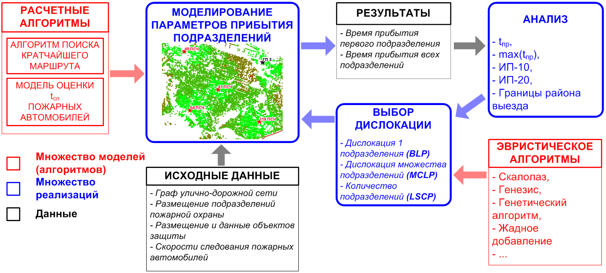

# Для пользователей

:::{.callout-important}

В данном разделе приведена информация рассчитанная на рядовых пользователей, которым достаточно общего понимания принципов работы библиотеки.

Более подробная информация для разработчиков приведена в разделе "Для разработчиков".

:::

## Типовая структура решения

{#fig-genesis_structure}

1. **Расчетные алгоритмы** -- указываются алгоритм поиска кратчайшего пути и модель оценки времени прибытия подразделения пожарной охраны используемые для моделирования параметров прибытия подразделений.

2. **Исходные данные** -- коллекция различных наборов пространственных данных (ГДС, размещение ПСЧ и зданий и т.д.). Также скоростной режим.

3. **Моделирования параметров прибытия подразделений пожарной охраны** -- основной блок решения, в котором при помощи расчетных алгоритмов и с использованием исходных данных происходит моделирование параметров прибытия подразделений пожарной охраны. Результатами моделирования является так называемое состояние (`state`) отражающее время прибытия подразделений пожарной охраны. В **Генезис** стандартно используется состояние времени прибытия первого подразделения пожарной охраны.

4. **Анализа** -- на основе состояния производится оценка требуемых в конкретном решении показателей (метрик). Также могут быть получены иные результаты анализа, например, оптимальные границы районов выезда.

5. **Эвристические алгоритмы** -- в зависимости от логики решения задачи используются те или иные эвристики или их гибриды .

6. **Выбор дислокации** -- основной блок решения, в котором на основе результатов анализа производится выбор оптимальной дислокации подразделений пожарной охраны исходя из конкретной задачи (`BLP`, `MCLP`, `LSCP`) и выбранного эвристического алгоритма.

> Курсивом на @fig-genesis_structure отмечены элементы, подразумевающие выбор. При разработке решения для конкретной ситуации можно использовать любой из предложенных вариантов или их комбинацию. Также можно разрабатывать дополнительные элементы, например, за счёт гибридизации эвристических алгоритмов.

В зависимости от поставленной задачи пользователь выбирает конкретные модели, алгоритмы и данные и комбинируя их получает решение. 

## Состав модулей библиотеки

Исходя из предложенной архитектуры и специфики выбранных инструментов, состав библиотеки Python был определён следующим образом:

### Модуль `genesis` *(ядро библиотеки, общие функции для решения задач BLP, MCLP, LSCP)*

| Подмодуль      | Описание                                       |
|----------------|------------------------------------------------|
| `blp.py`       | Реализации алгоритмов BLP                      |
| `core.py`      | Базовые классы функций                         |
| `lscp.py`      | Реализации алгоритмов LSCP                     |
| `mclp.py`      | Реализации алгоритмов MCLP                     |
| `metrics.py`   | Реализации функций расчёта метрик              |
| `point_selectors.py` | Реализации функций выбора узлов         |
| `states.py`    | Реализации функций расчёта параметров прибытия |
| `stop_cases.py`| Реализации функций правил остановки            |
| `swiss_knife.py`| Глобальные настройки уровня библиотеки        |
| `tools.py`     | Набор общих инструментов (например, перевод скоростей движения ПА из км/ч в м/мин) |
| `utils.py`     | Набор утилит, необходимых в разработке         |

### Модуль `fire_units` *(частные функции для решения задач пространственной оптимизации подразделений пожарной охраны)*

| Подмодуль      | Описание                                       |
|----------------|------------------------------------------------|
| `blp.py`       | Реализации алгоритмов BLP                      |
| `lscp.py`      | Реализации алгоритмов LSCP                     |
| `mclp.py`      | Реализации алгоритмов MCLP                     |
| `metrics.py`   | Реализации функций расчёта метрик              |
| `states.py`    | Реализации функций расчёта параметров прибытия |
| `settings.py`  | Настройки уровня модуля                        |

### Модуль `graphs` *(набор специальных алгоритмов для работы с графами)*

| Подмодуль      | Описание                                       |
|----------------|------------------------------------------------|
| `settings.py`  | Настройки уровня модуля                        |
| `speeds.py`    | Функции расчёта и установки скоростей следования пожарных автомобилей для ребер ГДС |
| `tools.py`     | Дополнительный набор инструментов              |

### Модуль `lists` *(набор справочников содержащих данные которые могут быть использованы в решения)*

| Подмодуль      | Описание                                       |
|----------------|------------------------------------------------|
| `allotments.py` | Набор данных для сопоставления тегов OSM с русскими наименованиями типов землепользования и их классами функциональной пожарной опасности КФПО |
| `buildings.py` | Набор данных для сопоставления тегов OSM с русскими наименованиями типов зданий и их классами функциональной пожарной опасности КФПО |
| `kfpo` | Набор данных для сопоставления КФПО со справочными данными о теоретической частоты возникновения пожаров, оценочного коэффициента последствий от пожаров и спроса на услуги пожарной охраны |

## Ядро системы

Ядром системы является модуль `genesis`, в котором реализованы базовые классы приложения и их частные реализации основных способов решения задач:

1. Задача определения наилучшей дислокации единственного подразделения (далее – **BLP**, от англ. *Best Location Problem*)
2. Задача определения наилучшей дислокации множества подразделений (**MCLP** – *Maximal Covering Location Problem*)
3. Задача определения количества подразделений при наилучшей дислокации (**LSCP** – *Location Set Covering Problem*)

Для решения задач пространственной оптимизации на графах этого модуля достаточно. Однако для реализации конкретных методик пользователь может разрабатывать собственные решения, основанные на имеющихся в `genesis` классах.

Например, для реализации описанных в данной работе моделей и алгоритмов в библиотеку добавлен модуль `fire_units`, который позволяет непосредственно решать задачи пространственной оптимизации подразделений пожарной охраны с учетом специфики законодательства Российской Федерации.

## Дополнительные модули 

`graphs` -- содержит специальные инструменты для манипуляции графами дорожной сети (ГДС):

- Загрузка графов.
- Добавление информации о скоростях и времени следования.
- Обрезка, склеивание.
- Выполнение операций из области теории графов.

`lists` -- содержит справочные сведения используемые в работе решения. Например, позволяют упростить процесс интерпретации и перевода на русский язык назначения зданий в процессе выгрузки из OSM.
