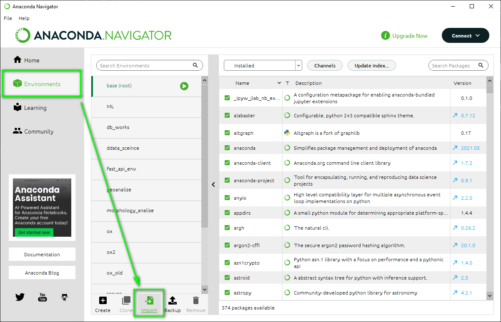
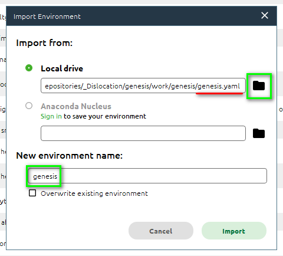
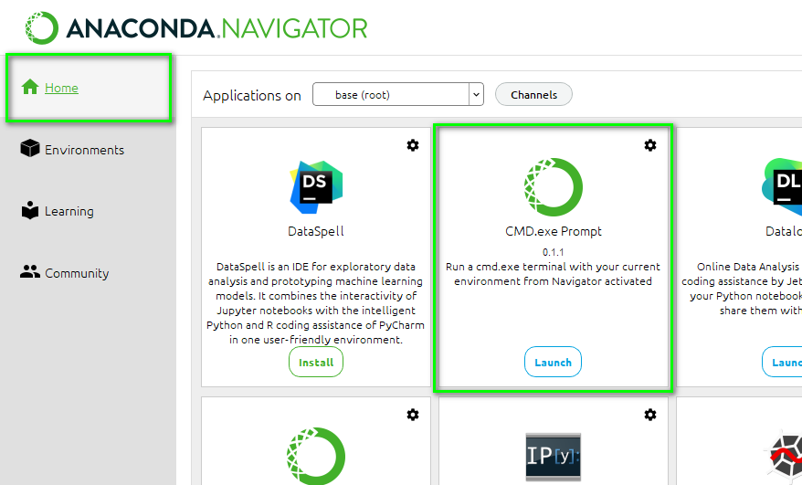
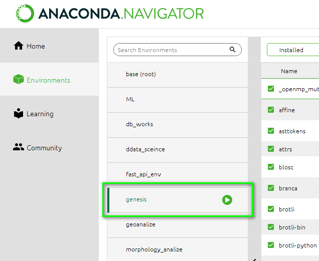

# Установка

Для большинства пользователей рекомендуется использование виртуальных окружений и Anaconda. Продвинутые пользователи и разработчики также могут использовать виртуальные среды env - их установка и использование описаны в разделе **Для разработчиков**.

Рекомендуемым инструментом для работы с программным кодом являются ноутбуки Jupiter в редакторе кода **Visual Studio Code**.


## Установка Anaconda и необходимых библиотек

### 🧰 Что нам понадобится: {.unnumbered}

1. **Anaconda** — это программа, которая помогает устанавливать и управлять разными версиями Python и библиотеками.
2. **Виртуальная среда** — изолированное "рабочее место", где будут установлены нужные программы. Так мы избежим конфликтов между различными проектами.
3. **Jupyter Notebook** — удобный инструмент для запуска и редактирования Python-файлов в браузере.
4. **Библиотеки:** `osmnx`, `networkx`, `contextily` — они помогут работать с картами и графами.

---

### Шаг 1: Установите Anaconda {.unnumbered}

Если у вас ещё нет Anaconda:

1. Перейдите на сайт: [https://www.anaconda.com/products/distribution](https://www.anaconda.com/products/distribution)
2. Установите программу, следуя указаниям установщика.

---

### Шаг 2: Создайте новую виртуальную среду импортировав перечень библиотек {.unnumbered}

1. Откройте **Anaconda Navigator** (на компьютере можно найти через меню Пуск или Launchpad).
2. Внизу слева выберите **Environments** (Среды).
3. Нажмите кнопку **Import** (Импорт).
{#fig-anaconda-import}
4. В поле **Local drive** (Локальное хранилище) укажите путь к файлу `genesis.yaml` [Скачать](https://cloud.mail.ru/public/ZUVE/UFQweuK5k)
5. В поле **New environment name** (Имя нового окружения) укажите имя создаваемого виртуального окружения, например `genesis`
{#fig-import-env}
6. Нажмите кнопку **Import** (Импорт)
7. Установка необходимых библиотек может потребовать некоторого времени - в зависимости от пропускной способности сети до 30 минут.


**Альтернативный вариант: создание новой виртуальной среды**

1. Откройте **Anaconda Navigator** (на компьютере можно найти через меню Пуск или Launchpad).
2. На вкладке **Home** (Домашняя) найдите среди приложений **CMD.exe Prompt** и нажмите кнопку **Install** (Установить) затем **Launch** (Запустить).
{#fig-env-setup-prompt1}
3. В командной строке введите 
```
conda create -n genesis -c conda-forge --strict-channel-priority osmnx ipykernel contextily
```
Вместо `genesis` можно указать любое другое название виртуального окружения. Затем нажмите Enter.

4. Установка необходимых библиотек может потребовать некоторого времени - в зависимости от пропускной способности сети до 30 минут.

---

### Готово! {.unnumbered}

Если все сделано правильно, в списке виртуальных окружений должно появиться новое окружение с именем `genesis` или иным, которе вы указали.

{#fig-anaconda-ready}

---


## Установка Visual Studio Code

### Шаг 1: Установите Visual Studio Code {.unnumbered}

1. Перейдите на официальный сайт: [https://code.visualstudio.com](https://code.visualstudio.com)
2. Нажмите **Download** и скачайте версию под вашу операционную систему.
3. После загрузки запустите установку и следуйте инструкциям.

---

### Шаг 2: Установите необходимые расширения {.unnumbered}

Откройте **VS Code**, затем:

1. Нажмите на значок **Extensions** слева (или нажмите `Ctrl+Shift+X`).
2. В строке поиска введите:
   - **Python**
   - **Jupyter**
3. Найдите расширения от Microsoft:
   - **Python** (Microsoft)
   - **Jupyter** (Microsoft)
4. Нажмите **Install** для каждого из них.

---

### Шаг 3: Убедитесь, что установлен Python {.unnumbered}

Если уже установлена **Anaconda**, то Python у вас также уже установлен.

---

### Шаг 4: Запуск Python в VS Code {.unnumbered}

1. Откройте любую папку через **File → Open Folder** (или просто откройте папку с проектом).
2. Создайте новый файл и назовите его, например, `test.ipynb`.
3. Создайте новую ячейку, для чего посередине верхней части текстового поля выберите **+Code** (**Add Code Cell**)
4. Введите в ячейке:
   ```{.python}
   print("Привет, мир!")
   ```
5. В появившемся выпадающем окне выберите нужную среду (например, `genesis`).
6. Нажмите правой кнопкой мыши на кнопке с изображением ▶️ в левой части ячейки **Execute cell**.
7. Если внизу появилось сообщение *"Привет, мир!"* — Python работает!

---

📌 **Совет**: Сохраняйте свои файлы `.ipynb` в отдельной папке, чтобы ничего не потерять.

---


## Установка библиотек Genesis

В настоящий момент библиотека Genesis все еще находится в процессе разработки. Поэтому установка ограничивается размещением рабочих папок библиотеки в рабочей папке вашего проекта.

### Шаг 1: Копирование файлов {.unnumbered}
1. Сохраните архив `genesis.rar` [Скачать](https://cloud.mail.ru/public/CLWT/TD3yfUn5N) в любую удобную папку.
2. Распакуйте архив и перенести папки `fire_units`, `genesis`, `graphs`, `lists` в рабочую папку проекта (папку в которой в дальнейшем будут размещаться ноутбуки и файлы с кодом Python).

---

### Шаг 2: Проверка работоспособности {.unnumbered}
1. Создайте новый ноутбук Jupiter
2. Создайте новую ячейку и введите следующий код:
```{.python}
import genesis

print(genesis.__version__)
```
3. ▶️ Запустите код в ячейке 
4. Если все сделано верно, программа напечатает текущую версию библиотеки `genesis`.

---


## Установка QGIS

### 🧰 Что такое QGIS? {.unnumbered}

**QGIS** — это бесплатная и мощная программа для работы с картами, геоданными и пространственным анализом. С его помощью можно отображать, редактировать, анализировать и публиковать географические данные.

Применительно к задачам пространственного размещения ПСЧ, QGIS позволяет манипулировать (добавлять, удалять, редактировать) пространственными данными, такими как точки размещения пожарных депо, здания, улицы и дороги, границы населенных пунктов и т.д.

---

### Шаг 1: Скачайте и установите QGIS {.unnumbered}

1. Перейдите на официальный сайт:  
   [https://qgis.org/ru/site/](https://qgis.org/ru/site/)
2. Нажмите на кнопку **Скачать QGIS**
3. Выберите версию под вашу операционную систему:
   - Windows — скачайте установщик (.exe)
   - macOS — скачайте .dmg
   - Linux — выберите дистрибутив
4. После загрузки запустите установщик и следуйте инструкциям.
   - На всех этапах можно оставлять параметры по умолчанию.

> ⏱️ Установка может занять несколько минут.

---

### Шаг 2: Запустите QGIS {.unnumbered}

После установки:

1. Найдите программу **QGIS** через меню Пуск (Windows) или Launchpad (macOS).
2. Откройте её — откроется пустой интерфейс программы.

---

### Шаг 3: Создайте новый проект {.unnumbered}

1. При запуске проект уже будет пустым. Если нет — нажмите:
   - **Проект → Новый** (в меню сверху)

Теперь вы готовы добавить на карту какие-то данные.

---

### Шаг 4: Добавьте базовую карту (подложку) {.unnumbered}

Чтобы видеть географическую основу:

1. В левой части экрана найдите **Панель браузера** (если её нет — нажмите `Ctrl+Shift+O`).
2. Разверните пункт **XYZ Tiles** → выберите, например, **OpenStreetMap**.
3. Перетащите **OpenStreetMap** на главное окно (на пустое поле).

> 🗺 Теперь вы видите интерактивную карту мира!

---

### Шаг 5: Добавьте географический объект (например, ПСЧ) {.unnumbered}

🚒 Допустим, мы хотим отметить точкой размещение ПСЧ:

1. Нажмите **Слой → Создать слой → Создать слой Geopackage**
2. Выберите тип геометрии: **Точка**
3. Укажите систему координат: `EPSG:4326` (стандартная система долгота/широта)
4. Назовите слой, например, "ПСЧ" (поле **Имя таблицы**)
5. Добавьте поле **name** типа **Текст (string)**
6. Нажмите **ОК**
7. Нажмите кнопку **Включить режим редактирования** (иконка карандаша)
8. Нажмите значок **Добавить точку**
9. Кликните на карте в нужном месте — появится точка
10. Укажите название новой ПСЧ
11. 💾 Сохраните изменения

---

### Шаг 6: Сохраните проект {.unnumbered}

1. Нажмите **Проект → Сохранить как...**
2. Выберите папку и назовите проект, например: `Первый_проект.qgz`
3. 💾 Нажмите **Сохранить**

Теперь вы можете закрыть и снова открыть этот файл, чтобы продолжить работу.


